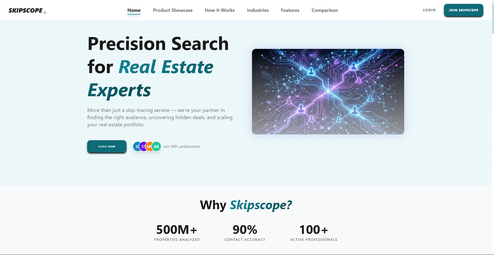
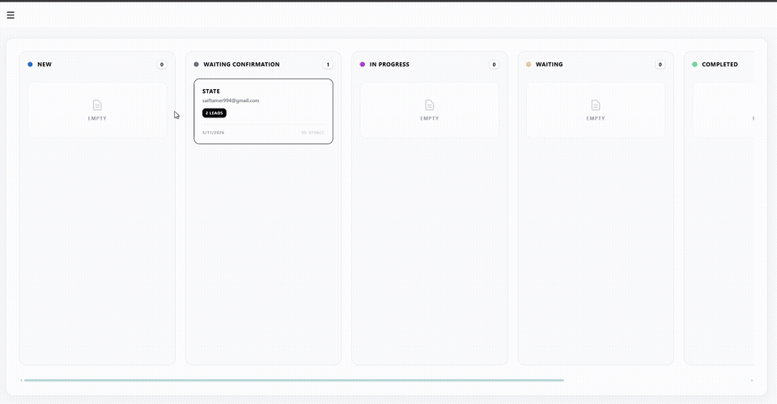
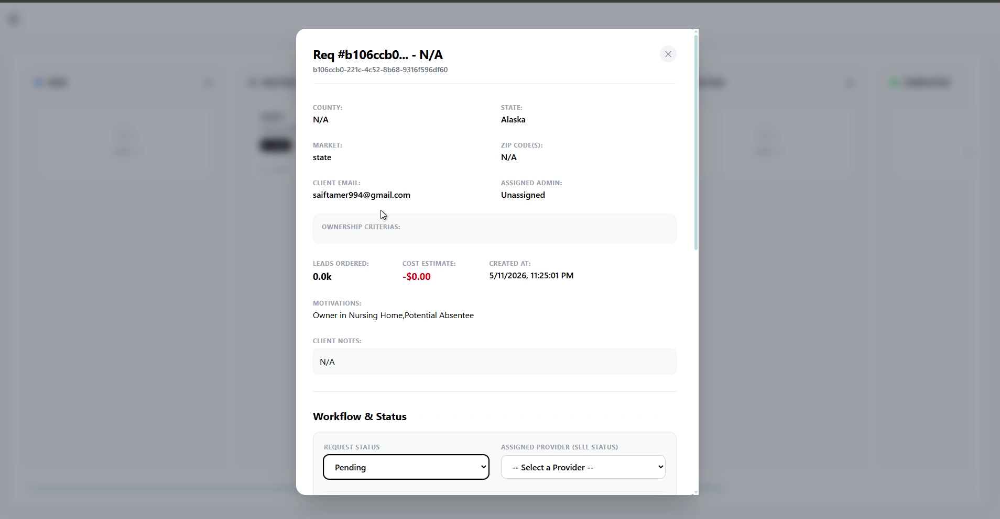

# Skipscope: skip tracing and lead data for real-estate investors

**Live:** [skipscope.com](https://skipscope.com)



### Demo





## What it is

Real-estate investors need accurate owner contact data to reach motivated sellers. Skipscope gives them a client portal to submit skip-tracing requests and get results back, and gives the team an internal dashboard to process those requests.

## Features

**Client portal**
- Sign-up and login with email verification and optional TOTP 2FA (QR setup)
- Submit skip-tracing requests with file uploads and validated input
- Request history and status tracking
- In-app notifications
- Billing section and account settings

**Admin and ops dashboard**
- Kanban board (drag and drop) to move requests through the pipeline
- User management and admin roles
- File delivery back to clients
- Analytics dashboard with charts
- Data provider management
- Slack alerts for new sign-ups and requests
- Support inbox

## Architecture

```
Next.js client (Vercel)  ── public site, client portal, admin area (route groups)
        │  REST
        ▼
Express API ──► Supabase (PostgreSQL, storage)
        │
        ├──► Resend (transactional email)
        └──► Slack (ops notifications via webhooks)
```

- **Client:** Next.js 16 (App Router with route groups), React 19, TypeScript, Tailwind, Radix UI / shadcn, dnd-kit, Recharts, Zustand, Motion
- **API:** Express + TypeScript, layered routes → controllers → services, Zod validation middleware
- **Data:** Supabase PostgreSQL with a SQL schema for auth, OTP and admin tables, plus Supabase Storage for files
- **Security:** Helmet, rate limiting, JWT auth, separate admin auth middleware, TOTP 2FA with AES-256 encrypted secrets, request IDs for tracing
- **Integrations:** Slack, Resend
- **SEO:** sitemap and robots generated by the app

## Engineering decisions

- **Separate auth for admins and clients.** Admin routes have their own middleware and session flow, so a client token can never reach an admin endpoint.
- **Validate at the edge.** Every request body goes through a Zod schema before it reaches a controller, so controllers only handle clean, typed data.
- **Request IDs on every call.** Each request gets an ID that shows up in the logs and error responses, which makes production bugs traceable.
- **Kanban as the ops source of truth.** Request status lives on the board the team already uses, so there's no second tracker to keep in sync.

## Project structure

```
client/   Next.js app (public site, client portal, admin dashboard)
server/   Express API (routes → controllers → services), Supabase SQL schemas, seed script
```

## Running locally

```bash
# API
cd server
cp .env.example .env   # fill in your Supabase, Slack and Resend values
npm install
npm run seed           # creates a demo user
npm run dev

# Client (in a second terminal)
cd client
npm install
npm run dev            # http://localhost:3000
```

## License

All rights reserved. The source is published for portfolio purposes only.

## Built by

[Saif Tamer](https://github.com/SaifTamer2010) · [LinkedIn](https://www.linkedin.com/in/saif-tamer-6477a7349/)
